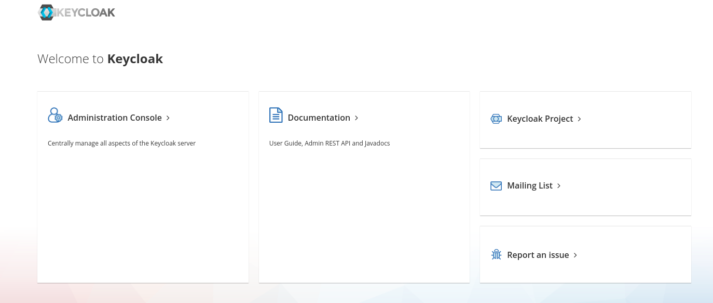
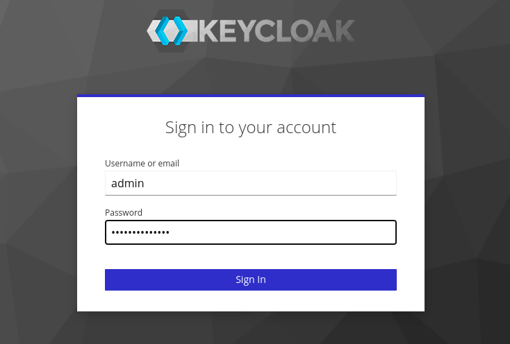

# sigstore-keycloak-setup

A guide for setting up Sigstore with Keycloak as an identity provider as in [Sigstore the Hard Way](https://sthw.decodebytes.sh/).

## Getting started

This guide provides the steps for configuring [Keycloak](https://www.keycloak.org/) as an identity provider in the context of a Sigstore deployment on GCP as in [Sigstore The Hard Way](https://sthw.decodebytes.sh/).
It is a replacement for the [step 5](https://sthw.decodebytes.sh/05-dex.html) of the tutorial where Dex is normally deployed as the OAuth2 server used for Sigstore signing.

Keycloak is an open source Identity and Access Management solution that provides OpenID Connect capabilities.
The following steps assume that steps 1-4 from the Sigstore The Hard Way tutorial were successfully completed.

### 1. Provision an instance for the Keycloak server

As in the [step 2](https://sthw.decodebytes.sh/02-compute-resources.html) of Sigstore the Hard Way, provision an instance for the Keycloak server:

```
gcloud compute instances create sigstore-keycloak \
    --async \
    --boot-disk-size 200GB \
    --image-family debian-10 \
    --image-project debian-cloud \
    --machine-type e2-small \
    --private-network-ip 10.240.0.10 \
    --scopes compute-rw,storage-ro,service-management,service-control,logging-write,monitoring \
    --subnet sigstore \
    --tags sigstore-the-hard-way-proj,sigstore-keycloak
```

When the instance is created, associate a static (IPv4) IP address to the instance.
Allocate the IP address:

```
gcloud compute addresses create ADDRESS_NAME  \
    --region=REGION
```

[Associate the IP address](https://cloud.google.com/compute/docs/ip-addresses/reserve-static-external-ip-address#IP_assign) with your Keycloak instance:

```
gcloud compute instances add-access-config VM_NAME \
   --access-config-name="ACCESS_CONFIG_NAME" --address=IP_ADDRESS
```

### 2. Configure DNS resolution

If not done already, configure a `keycloak` subdomain for your domain name (for example: `keycloak.example.com`).
Follow the same steps as in the [Domain Configuration](https://sthw.decodebytes.sh/03-domain-configuration.html#configuration) section of STHW for the `keycloak` subdomain.

In the Google Cloud console, ensure the subdomain resolves to the reserved static IP address configured by going to `Network Services` > `Cloud DNS` and selecting your zone.
Select the corresponding subdomain and verify that the IP address is correct.

### 3. Deploy Keycloak

To start deploying Keycloak, ssh into your instance:

```
gcloud compute ssh sigstore-keycloak
```

If not installed, get `wget` and `unzip`:

```
sudo apt-get update -y
sudo apt-get install wget unzip
```

#### 3.1 Install Keycloak on your server

Note: This guide shows how to deploy Keycloak as a standalone server, but it is also possible to start the server as a [container](https://www.keycloak.org/server/containers).

Go to the [Keycloak downloads page](https://www.keycloak.org/downloads.html) and select the download URL for the latest version. This tutorial uses the version 21.0.2 of Keycloak.
Get the zip file on your instance:

```
wget https://github.com/keycloak/keycloak/releases/download/21.0.2/keycloak-21.0.2.zip
```
(Or URL with the desired version)

Decompress the file:

```
unzip keycloak-21.0.2.zip
```

#### 3.2 Configure Let's Encrypt and HAproxy

Follow the same [steps](https://sthw.decodebytes.sh/06-fulcio.html#lets-encrypt-tls--ha-proxy-config) from STHW to configure TLS with Let's Encrypt for your domain, replacing the `$DOMAIN` name with your `keycloak` subdomain.
The HAproxy configuration is similar to the one described in the tutorial, except for the `haproxy.cfg` file that must override request headers to work with Keycloak.

In place of the file from the tutorial, write the following configuration for `haproxy.cfg` (replacing `10.240.0.12` with your instance internal IP address):

```
defaults
    timeout connect 10s
    timeout client 30s
    timeout server 30s
    log global
    mode http
    option httplog
    maxconn 3000
    log 127.0.0.1 local0

frontend haproxy
    #public IP address
    bind 10.240.0.12:80
    bind 10.240.0.12:443 ssl crt /etc/ssl/private/keycloak.example.com.pem

    # HTTPS redirect
    redirect scheme https code 301 if !{ ssl_fc }

    acl letsencrypt-acl path_beg /.well-known/acme-challenge/
    use_backend letsencrypt-backend if letsencrypt-acl

    http-request redirect scheme https unless { ssl_fc }
        default_backend sigstore_keycloak
    http-request set-header X-Forwarded-Proto https if { ssl_fc }
    http-request set-header X-Forwarded-Proto http if !{ ssl_fc }

backend sigstore_keycloak
    http-request redirect scheme https unless { ssl_fc }
        server sigstore_keycloak_internal 10.240.0.12:8080

backend letsencrypt-backend
    server certbot_internal 127.0.0.1:9080
```

Be careful of writing the correct headers and of specifying the correct port number (8080) for the Keycloak server, where the HTTPS traffic will be redirected.
The template file is also available [in this repository](haproxy.cfg).

As for the rest of the tutorial section, move the configuration file under `/etc/haproxy/` and check the file syntax:

```
sudo /usr/sbin/haproxy -c -V -f /etc/haproxy/haproxy.cfg
```

Then enable and restart the `haproxy` systemd service:

```
sudo systemctl enable haproxy.service
sudo systemctl restart haproxy.service
```

Verify that the service is running:

```
sudo systemctl status haproxy.service
```

#### 3.3 Start the Keycloak server

Go to the `keycloak-{version number}` directory extracted from step 3.1.
To intialize the admin user, set the `KEYCLOAK_ADMIN` and `KEYCLOAK_ADMIN_PASSWORD` environment variables.
Start the Keycloak server with the following command:

```
sudo bin/kc.sh start \
--https-certificate-file=/etc/letsencrypt/live/keycloak.example.com/cert.pem \
--https-certificate-key-file=/etc/letsencrypt/live/keycloak.example.com/privkey.pem \
--hostname-strict=false \
--proxy=edge \
--https-port=8080
```

For more information about configuring Keycloak behind a reverse proxy, refer to the [documentation](https://www.keycloak.org/server/reverseproxy).

Within a few seconds, the Keycloak server should be running and listening on port 8080 (default port) for HTTPS requests:

```
2023-04-03 08:42:49,783 INFO  [org.keycloak.quarkus.runtime.hostname.DefaultHostnameProvider] (main) Hostname settings: Base URL: <unset>, Hostname: <request>, Strict HTTPS: false, Path: <request>, Strict BackChannel: false, Admin URL: <unset>, Admin: <request>, Port: -1, Proxied: true
2023-04-03 08:42:54,952 WARN  [io.quarkus.agroal.runtime.DataSources] (main) Datasource <default> enables XA but transaction recovery is not enabled. Please enable transaction recovery by setting quarkus.transaction-manager.enable-recovery=true, otherwise data may be lost if the application is terminated abruptly
2023-04-03 08:42:58,216 INFO  [org.infinispan.SERVER] (keycloak-cache-init) ISPN005054: Native IOUring transport not available, using NIO instead: io.netty.incubator.channel.uring.IOUring
2023-04-03 08:42:58,608 WARN  [org.infinispan.PERSISTENCE] (keycloak-cache-init) ISPN000554: jboss-marshalling is deprecated and planned for removal
2023-04-03 08:42:58,729 WARN  [org.infinispan.CONFIG] (keycloak-cache-init) ISPN000569: Unable to persist Infinispan internal caches as no global state enabled
2023-04-03 08:42:58,773 INFO  [org.infinispan.CONTAINER] (keycloak-cache-init) ISPN000556: Starting user marshaller 'org.infinispan.jboss.marshalling.core.JBossUserMarshaller'
2023-04-03 08:42:59,121 WARN  [io.quarkus.vertx.http.runtime.VertxHttpRecorder] (main) The X-Forwarded-* and Forwarded headers will be considered when determining the proxy address. This configuration can cause a security issue as clients can forge requests and send a forwarded header that is not overwritten by the proxy. Please consider use one of these headers just to forward the proxy address in requests.
2023-04-03 08:42:59,766 INFO  [org.keycloak.broker.provider.AbstractIdentityProviderMapper] (main) Registering class org.keycloak.broker.provider.mappersync.ConfigSyncEventListener
2023-04-03 08:43:00,062 INFO  [org.infinispan.CLUSTER] (keycloak-cache-init) ISPN000088: Unable to use any JGroups configuration mechanisms provided in properties {}. Using default JGroups configuration!
2023-04-03 08:43:00,238 INFO  [org.infinispan.CLUSTER] (keycloak-cache-init) ISPN000078: Starting JGroups channel `ISPN`
2023-04-03 08:43:00,256 INFO  [org.jgroups.JChannel] (keycloak-cache-init) local_addr: 8fddd816-2172-40bb-9d45-76b6ba487add, name: sigstore-keycloak-12281
2023-04-03 08:43:00,262 WARN  [org.jgroups.protocols.UDP] (keycloak-cache-init) JGRP000015: the send buffer of socket MulticastSocket was set to 1MB, but the OS only allocated 212.99KB
2023-04-03 08:43:00,263 WARN  [org.jgroups.protocols.UDP] (keycloak-cache-init) JGRP000015: the receive buffer of socket MulticastSocket was set to 20MB, but the OS only allocated 212.99KB
2023-04-03 08:43:00,264 WARN  [org.jgroups.protocols.UDP] (keycloak-cache-init) JGRP000015: the send buffer of socket MulticastSocket was set to 1MB, but the OS only allocated 212.99KB
2023-04-03 08:43:00,265 WARN  [org.jgroups.protocols.UDP] (keycloak-cache-init) JGRP000015: the receive buffer of socket MulticastSocket was set to 25MB, but the OS only allocated 212.99KB
2023-04-03 08:43:00,277 INFO  [org.jgroups.protocols.FD_SOCK2] (keycloak-cache-init) server listening on *.27882
2023-04-03 08:43:02,293 INFO  [org.jgroups.protocols.pbcast.GMS] (keycloak-cache-init) sigstore-keycloak-12281: no members discovered after 2010 ms: creating cluster as coordinator
2023-04-03 08:43:02,353 INFO  [org.infinispan.CLUSTER] (keycloak-cache-init) ISPN000094: Received new cluster view for channel ISPN: [sigstore-keycloak-12281|0] (1) [sigstore-keycloak-12281]
2023-04-03 08:43:02,365 INFO  [org.infinispan.CLUSTER] (keycloak-cache-init) ISPN000079: Channel `ISPN` local address is `sigstore-keycloak-12281`, physical addresses are `[10.240.0.12:43418]`
2023-04-03 08:43:03,245 INFO  [org.keycloak.connections.infinispan.DefaultInfinispanConnectionProviderFactory] (main) Node name: sigstore-keycloak-12281, Site name: null
2023-04-03 08:43:05,091 INFO  [io.quarkus] (main) Keycloak 21.0.2 on JVM (powered by Quarkus 2.13.7.Final) started in 20.026s. Listening on: http://0.0.0.0:8080 and https://0.0.0.0:8080
2023-04-03 08:43:05,091 INFO  [io.quarkus] (main) Profile prod activated. 
2023-04-03 08:43:05,091 INFO  [io.quarkus] (main) Installed features: [agroal, cdi, hibernate-orm, jdbc-h2, jdbc-mariadb, jdbc-mssql, jdbc-mysql, jdbc-oracle, jdbc-postgresql, keycloak, logging-gelf, micrometer, narayana-jta, reactive-routes, resteasy, resteasy-jackson, smallrye-context-propagation, smallrye-health, vertx]
```

### 4. Configure the Sigstore OIDC client

#### 4.1 Create the Sigstore realm

Once the Keycloak server is started, go to your Keycloak domain on your local machine browser.
Connect as the admin user by going to the `Administration Console` and entering the configured admin username and password.





Create the `sigstore` realm by clicking on `Create realm` in the top left menu, then go to the newly created realm.


#### 4.2 Configure the Sigstore client

In the `Clients` section, select `Create client`.
In `General settings`, select `OpenID Connect` for the client type, and `sigstore` for the client ID.
In `Capability config`, set `Client authentication` to `On` and check the `Standard Flow` and `Service Account Roles` boxes.
In `Login settings`, set the `Root URL` and `Home URL` to the base domain URL (i.e. `https://keycloak.example.com`), and `Valid redirect URIs` to `*`.
Select `Save`.

Go to the created `sigstore` client.

**Add expected claims to the identity token**

The steps below allow to set the claims expected by Sigstore in the OIDC tokens generated by Keycloak.
In the `Client scopes` tab, go to `sigstore-dedicated` and add `email` and `email_verified` by selecting `Add mapper` > `From predefined mapper` and checking the corresponding boxes.
Then select `Add mapper` > `By configuration` > `Hardcoded claim`, and enter the following values:

- `Name`: `audience`
- `Token Claim Name`: `aud`
- `Claim value`: `sigstore`

Set `Add to ID token` as `On`.

Note: In the `Credentials` section for the client, you will find the OIDC client secret you can pass to Sigstore to get an identity token. The client ID must always be `sigstore`.

#### 4.3 Create a `sigstore` user

In the `Users` tab, select `Add user`.
Leave `Required user actions` blank, add `sigstore` as a username and enter the email you want to sign artifacts with. Set `Email verified` to `On`.
Then go to the `Credentials` tab and configure a password for the `sigstore` user.

Log out from the admin console.

### 5. Configure Fulcio to accept tokens from Keycloak

The next step is to add your Keycloak server as a recognized identity provider to your Fulcio instance configuration.
For the Fulcio server to start, it is necessary that all the identity providers specified in the configuration are up and running.

SSH into your Fulcio instance:

```
gcloud compute ssh sigstore-fulcio
```

Follow the steps from the [section 6](https://sthw.decodebytes.sh/06-fulcio.html) of STHW to configure the Fulcio instance before the [Fulcio Config](https://sthw.decodebytes.sh/06-fulcio.html#fulcio-config) part.
Insert the configuration for your Keycloak server in `config.json`:

```
"https://keycloak.example.com/realms/sigstore": {
      "IssuerURL": "https://keycloak.example.com/realms/sigstore",
      "ClientID": "sigstore",
      "Type": "email"
    }
```

**Note:** It is important to have the exact same URL between the one in the config and the one that will be passed to Sigstore to sign artifacts. Trailling slashes should also match.

Make sure your Keycloak instance is reachable at the configured URL and start the Fulcio server as specified in the tutorial.

### 6. Sign an artifact

Your custom Sigstore instance should now be up and ready for use.
To verify if everything has been set up correctly, follow the cosign set up from STHW [step 10](https://sthw.decodebytes.sh/10-sign-container.html) and run `cosign sign` with options as follows:

```
COSIGN_EXPERIMENTAL=1 cosign sign --fulcio-url https://fulcio.example.com --oidc-issuer https://keycloak.example.com/realms/sigstore --rekor-url https://rekor.example.com <IMAGE>
```
Note: the `COSIGN_EXPERIMENTAL=1` environment variable should not be necessary anymore from cosign v2.0.0.

A browser window should open to redirect you to the Keycloak login page.
Log in as the `sigstore` user and enter the password configured at step 4.3. You should be redirected to the `Sigstore authentication successful` window.

Verify the command output to see if the container image has been signed successfully.


## Bug reports and improvements

To report any bug, issue or improvement proposal to this tutorial, please open an issue describing your request in the repository.


## Credits

This tutorial is an extension to the Sigstore the Hard Way tutorial available at [https://sthw.decodebytes.sh/](https://sthw.decodebytes.sh/).
